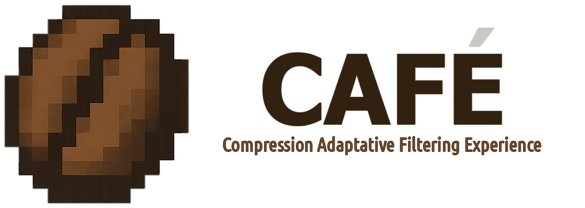

# 

[](https://opensource.org/licenses/MIT)
[](https://github.com/yourusername/cafe-format)
[](<https://en.wikipedia.org/wiki/C_(programming_language)>)

> **An experimental image format designed for machine learning pipelines and research**

**CAFE** (Compression Adaptive Filtering Experiment) is a block-based, lossless image format built from the ground up for modern computational workflows. Born from a Master's thesis in Artificial Intelligence, it addresses the I/O bottlenecks that plague large-scale computer vision tasks.

## 🔍 What Problem Does CAFE Solve?

Traditional image formats were designed for display, not computation. When training ML models or processing HDR content:

- **Thousands of tiny files** create filesystem overhead
- **Serial loading** limits data throughput
- **Metadata is separate** from image data
- **No native GPU acceleration** for decompression
- **HDR workflows are fragmented** across multiple formats (EXR, HDR, TIFF)
- **No integrated AI metadata** (embeddings, labels, masks live in separate databases)

CAFE reimagines image storage for the age of machine learning and HDR content creation by packaging entire datasets with their metadata in a single, GPU-accelerated container.

## 🏗️ Core Architecture

CAFE is built around simple but powerful principles:

### **Block-Based Design**

```text
# Each image is divided into independent 128×128 blocks

[█████████] [█████████]
[ Block 1 ] [ Block 2 ] # Decode in parallel
[█████████] [█████████]
```

### **Intelligent Compression**

- **Primary codec**: Zstandard (ZSTD) for speed/ratio balance
- **Secondary**: Finite State Entropy (FSE) for low-entropy data
- **Optional**: Predictors to reduce spatial redundancy
- **No compression**: When counterproductive

### **AI-Ready Metadata**

Store embeddings, labels, segmentation masks, and features directly alongside the pixels they describe.

## ✨ Key Features (v1.0 Specification)

- **🎨 HDR Support**: Native FP16/FP32 formats with professional color spaces (Rec.2020, DCI-P3, ACEScg)
- **🚀 GPU Acceleration**: CUDA-based parallel decompression targeting 16 GB/s throughput
- **🧠 AI Metadata**: Embeddings, labels, and segmentation masks embedded with image data
- **📦 Multi-Image Containers**: Thousands of images in a single file with random access
- **⚡ Adaptive Compression**: ZSTD + FSE with intelligent codec selection
- **🎯 Block Parallelism**: Independent 128×128 blocks enable multi-threaded decoding
- **🌈 Tone Mapping**: Built-in operators (Reinhard, ACES, Filmic, Hable) for HDR-to-SDR conversion
- **🐍 Python Integration**: NumPy arrays, PyTorch DataLoader, TensorFlow Dataset APIs
- **🔍 Progressive Decoding**: Stream and decode on-the-fly for web and remote storage
- **🛡️ Error Resilience**: Per-block CRC-32 checksums with graceful degradation

## ⚙️ Technical Specifications

| Feature                | Implementation                                      | Benefit                 |
| ---------------------- | --------------------------------------------------- | ----------------------- |
| **Block Size**         | 128×128 pixels                                      | Parallel decoding       |
| **Compression**        | ZSTD + FSE                                          | Fast decompression      |
| **Color Depth**        | 8/10/12/16-bit integer + FP16/FP32 HDR              | SDR & HDR imaging       |
| **Color Spaces**       | sRGB, Linear, Rec.709, Rec.2020, DCI-P3, ACEScg     | Professional workflows  |
| **Transfer Functions** | Linear, sRGB, PQ (HDR10), HLG                       | HDR content mastering   |
| **Alpha Channel**      | Supported in all modes                              | Transparency            |
| **Error Recovery**     | Per-block CRC + delimiters                          | Robustness              |
| **Streaming**          | Progressive decoding                                | Web/remote viewing      |
| **AI Metadata**        | Embeddings, labels, masks alongside image data      | ML pipeline integration |

## 🚧 Current Status

**Important**: This is a solo research project being developed from the ground up as part of a Master's thesis. The format specification is complete, but implementation is starting from zero.

### **Development Phase: Bootstrap (Month 1)**

**Current Target**: v1.0 Specification Complete ✅

- ✅ Complete format specification document (PROJECT_SPECIFICATION.md)
- ✅ Detailed implementation plan with 10 phases (IMPLEMENTATION_PLAN.md)
- ✅ HDR support specification (FP16/FP32, color spaces, tone mapping)
- ✅ Future extensions roadmap (v2.0+)

**Next Steps**: Phase 0 implementation begins

- 📋 Project structure and build system (CMake, Meson)
- 📋 Dependency integration (ZSTD, FSE)
- 📋 Core type definitions and endianness handling
- 📋 Memory management and error handling foundation
- 📋 Basic unit test infrastructure

## 📦 Getting Started

### Current Status: Specification Phase

CAFE is currently in **active development** with a complete specification but no code implementation yet. If you're interested in:

- **Using CAFE**: Check back in ~6 months for the first MVP release (Phase 1 complete)
- **Contributing**: Review [PROJECT_SPECIFICATION.md](PROJECT_SPECIFICATION.md) and [IMPLEMENTATION_PLAN.md](IMPLEMENTATION_PLAN.md)
- **Following progress**: Watch this repository for updates

### What You Can Do Now

1. **Read the Full Specification**
   ```bash
   # Clone the repository
   git clone https://github.com/seccofs/cafe.git
   cd cafe

   # Read the technical specification
   cat PROJECT_SPECIFICATION.md

   # Review the implementation plan
   cat IMPLEMENTATION_PLAN.md
   ```

2. **Provide Feedback**
   - Open an issue with suggestions or questions
   - Discuss use cases for your ML pipelines
   - Suggest additional features for v2.0+

3. **Stay Updated**
   - Star the repository to track progress
   - Follow the roadmap milestones

### Planned API Preview (v1.0)

Once implemented, the C API will look like this:

```c
#include <cafe.h>

// Open a CAFE file
cafe_file_t* file = cafe_open("dataset.cafe", "rb");

// Read header and image descriptor
cafe_header_t header;
cafe_image_descriptor_t img_desc;
cafe_read_header(file, &header);
cafe_read_image_descriptor(file, &img_desc, 0);

// Decode image (automatic HDR detection)
cafe_image_t* image = cafe_decode_image(file, 0);

// For HDR content: tone map to SDR for display
if (img_desc.is_hdr) {
    cafe_image_t* sdr = cafe_tonemap_aces(image, 100.0f, 1.0f);
    cafe_image_free(image);
    image = sdr;
}

cafe_close(file);
```

Python bindings (Phase 6) will provide PyTorch/TensorFlow DataLoader integration:

```python
from cafe import CafeDataset

# Load CAFE container as PyTorch dataset
dataset = CafeDataset('imagenet.cafe', transform=transforms.ToTensor())
loader = DataLoader(dataset, batch_size=64, num_workers=4)

for images, labels in loader:
    # labels come from embedded AI metadata
    train_step(images, labels)
```

## 🏃‍♂️ Performance Goals

| **Scenario**                 | **Target Improvement**            |
| ---------------------------- | --------------------------------- |
| Batch loading (1000+ images) | 3-5× faster than PNG              |
| GPU decompression            | 10× faster than CPU               |
| Storage efficiency (SDR)     | 10-30% better than PNG            |
| Storage efficiency (HDR)     | 20-40% better than EXR            |
| HDR tone mapping (GPU)       | Real-time at 4K resolution        |
| Memory usage                 | 50% reduction vs individual files |
| Multi-image container        | 80-90% metadata overhead reduction|

_These are research targets based on preliminary analysis, not performance guarantees._

## 🧠 The Research Angle

CAFE is more than just a file format—it's a testbed for exploring critical questions at the intersection of computer vision, HDR imaging, and machine learning:

1.  **How much can we accelerate ML training by optimizing the I/O layer?**
    - Hypothesis: 3-5× speedup on batch loading through GPU decompression and block parallelism

2.  **Can intelligent compression reduce cloud storage and training costs?**
    - Hypothesis: 15-25% cost reduction through adaptive codec selection and multi-image containers

3.  **What metadata should live with images in AI workflows?**
    - Investigation: Optimal storage for embeddings, labels, masks, and features

4.  **How can we unify HDR workflows across computer vision and content creation?**
    - Exploration: Single format supporting FP16/FP32, multiple color spaces, and real-time tone mapping

5.  **What's the performance ceiling of GPU-accelerated image decompression?**
    - Target: Saturate PCIe bandwidth (16 GB/s) with CUDA-based parallel decoding

This project explores data format design as a first-class optimization target for machine learning systems.

## 🤔 Why "CAFE"?

**Pronounced "kah-FEH"** (like coffee in Portuguese/Brazilian), the name reflects the project's philosophy beyond its acronym (Compression Adaptive Filtering Experiment):

- **Rich and complex** (like a well-crafted espresso)
- **Meant to fuel work** (especially during long training sessions)
- **Better shared** (open source, like coffee shared among colleagues)
- **Universally appealing** (transcends language barriers)

Just as coffee shops have historically been hubs of intellectual exchange, CAFE aims to be a meeting point for ideas in compression, computer vision, and machine learning systems.

## 🛣️ Development Roadmap

### **Version 1.0 - Core Implementation** (30 months)

**Phase 0: Bootstrap** (Month 1)
- Project structure and build system
- Core dependencies integration (ZSTD, FSE, zlib)
- Basic type definitions and memory management

**Phase 1: MVP - Single Image** (Months 2-4)
- File format I/O (headers, magic bytes, versioning)
- Single image encoding/decoding
- ZSTD compression pipeline
- Block-based architecture (128×128)

**Phase 2: Multi-Image Containers** (Months 5-6)
- Multi-image file support
- Image indexing and metadata
- Sequential and random access APIs

**Phase 3: FSE Codec** (Months 7-8)
- Finite State Entropy compression
- Low-entropy block detection
- Codec auto-selection logic

**Phase 4: Predictors** (Month 9)
- Differential coding (horizontal, vertical)
- Median predictor
- Paeth predictor

**Phase 5: HDR Support** (Months 10-11)
- FLOAT16 and FLOAT32 pixel formats
- Color space transformations (sRGB, Rec.2020, DCI-P3, ACEScg)
- Transfer functions (Linear, PQ/HDR10, HLG)
- Tone mapping operators (Reinhard, ACES, Filmic, Hable)

**Phase 6: Python Bindings** (Months 12-14)
- CFFI-based bindings
- NumPy array integration
- PyTorch/TensorFlow DataLoader compatibility
- HDR workflow support

**Phase 7: GPU Acceleration** (Months 15-18)
- CUDA kernel development
- nvCOMP integration for decompression
- Batch processing API
- Multi-stream parallel decoding

**Phase 8: AI Metadata** (Months 19-21)
- Metadata chunk specification
- Embeddings storage (BERT, CLIP, etc.)
- Labels and classification data
- Segmentation masks
- Feature vectors

**Phase 9: Performance Optimization** (Months 22-25)
- SIMD optimization (SSE, AVX, NEON)
- Memory pooling and zero-copy APIs
- Cache-friendly data structures
- Profiling and bottleneck elimination

**Phase 10: Production Readiness** (Months 26-30)
- Comprehensive test suite (unit, integration, fuzzing)
- Extensive benchmarking vs PNG/WebP/JPEG-XL/EXR
- CLI tools (cafe-convert, cafe-inspect, cafe-benchmark)
- Documentation and examples
- **v1.0 Release**

### **Version 2.0+ - Advanced Features** (12-18 months post-v1.0)

The following extensions are specified but deferred to maintain v1.0 focus:

**Planned for v2.0:**
- **Video/Temporal Support**: Frame sequences with motion vectors
- **Multi-Modal Data**: Point clouds, depth maps, optical flow
- **Cloud-Native Optimizations**: Byte-range requests, partial chunk downloads
- **Smart Metadata Indexing**: Searchable embeddings with ANN indices

**Planned for v2.1:**
- **ROI Decoding**: Decode only regions of interest
- **Multi-Resolution Pyramid**: Hierarchical LOD for progressive loading

**Planned for v2.2:**
- **Neural Codec Support**: Learned compression integration
- **Encryption & Signing**: AES-256-GCM, Ed25519 digital signatures

**Planned for v3.0:**
- **Annotation Rendering**: Real-time overlay of bboxes, masks, keypoints

_Full specifications for these features are documented in PROJECT_SPECIFICATION.md Appendix D._

## 🤝 Contributing & Feedback

CAFE is currently in the **specification phase** as part of a Master's thesis. This is the perfect time to influence the design before implementation is finalized!

### How You Can Help Now

- 💬 **Discuss use cases**: Share your ML pipeline bottlenecks and requirements
- 🐛 **Review specifications**: Read [PROJECT_SPECIFICATION.md](PROJECT_SPECIFICATION.md) and suggest improvements
- 🎯 **Propose features**: Open issues with ideas for v2.0+ extensions
- 📊 **Share benchmarks**: Provide data on current format performance in your workflows
- 🤝 **Research collaboration**: Co-authorship opportunities for performance studies

### Future Contributions (Once Implementation Begins)

- **Pull requests welcome** for bug fixes, optimizations, and new features
- **Platform support**: Help with Windows/macOS builds, ARM architecture, etc.
- **Bindings**: Rust, Go, Julia, or other language wrappers
- **Tooling**: Converters, validators, profilers, and debugging utilities

If you're working on ML systems, GPU computing, HDR imaging, or compression algorithms, let's collaborate!

## 📚 Academic Context

CAFE is being developed as part of a Master's thesis in Artificial Intelligence at American Global Tech University. The research demonstrates that data format design is a critical, often overlooked optimization in machine learning pipelines.

**Research Questions**

1.  Can block-based GPU decompression saturate modern I/O bandwidth?
2.  How much energy/cost savings result from intelligent compression in cloud ML?
3.  Does co-locating metadata with image data improve training throughput?
4.  What's the overhead of supporting HDR workflows in an ML-optimized format?

**Planned Publications**

1.  **CAFE Format Specification** - Complete technical specification (✅ Complete - Feb 2026)
2.  **Performance Analysis** - Benchmarks vs PNG/WebP/JPEG-XL/EXR (Target: Q4 2026)
3.  **Case Study** - Impact on ImageNet-scale training pipelines (Target: Q2 2027)
4.  **HDR-ML Integration** - Unified workflows for computer vision and content creation (Target: Q3 2027)

**Timeline**

- Feb 2026: Specification complete, implementation begins
- Q4 2026: MVP release (Phase 1-2)
- Q2 2027: Full v1.0 release with HDR and GPU acceleration
- Q3 2027: Thesis defense and publication

## 📄 License

CAFE Format is licensed under the MIT License:

```text
MIT License

Copyright (c) 2026 Daniel Secco

Permission is hereby granted, free of charge, to any person obtaining a copy
of this software and associated documentation files (the "Software"), to deal
in the Software without restriction, including without limitation the rights
to use, copy, modify, merge, publish, distribute, sublicense, and/or sell
copies of the Software, and to permit persons to whom the Software is
furnished to do so, subject to the following conditions:

The above copyright notice and this permission notice shall be included in all
copies or substantial portions of the Software.

THE SOFTWARE IS PROVIDED "AS IS", WITHOUT WARRANTY OF ANY KIND, EXPRESS OR
IMPLIED, INCLUDING BUT NOT LIMITED TO THE WARRANTIES OF MERCHANTABILITY,
FITNESS FOR A PARTICULAR PURPOSE AND NONINFRINGEMENT. IN NO EVENT SHALL THE
AUTHORS OR COPYRIGHT HOLDERS BE LIABLE FOR ANY CLAIM, DAMAGES OR OTHER
LIABILITY, WHETHER IN AN ACTION OF CONTRACT, TORT OR OTHERWISE, ARISING FROM,
OUT OF OR IN CONNECTION WITH THE SOFTWARE OR THE USE OR OTHER DEALINGS IN THE
SOFTWARE.
```

See LICENSE file for the complete text.

## 📚 Third-Party Licenses

CAFE uses the following third-party libraries:

### Zstandard (ZSTD)

- License: BSD 3-Clause License / GPLv2 (dual licensed)
- Usage: Primary compression/decompression engine
- Source: <https://github.com/facebook/zstd>
- Copyright: Facebook, Inc. and affiliates

### Finite State Entropy (FSE)

- License: BSD 2-Clause License
- Usage: Secondary compression for low-entropy data
- Source: <https://github.com/Cyan4973/FiniteStateEntropy>
- Copyright: Yann Collet

## 📝 Citation

If you use or reference CAFE in academic work, please cite:

```bibtex
@mastersthesis{cafe2026,
    title={CAFE: An Image Format Optimized for Machine Learning Pipelines},
    author={Daniel Secco Ferreira e Silva},
    year={2026},
    school={American Global Tech University},
    type={Master's Thesis},
    note={Compression Adaptive Filtering Experiment - Specification v1.0}
}
```

For referencing the format specification specifically:

```bibtex
@techreport{cafe-spec-v1,
    title={CAFE Format Specification v1.0},
    author={Daniel Secco Ferreira e Silva},
    institution={American Global Tech University},
    year={2026},
    month={February},
    url={https://github.com/seccofs/cafe}
}
```

# 💭 Final Thoughts

In an era where we spend thousands of GPU-hours training models, we often overlook the simplest optimization: how we store and retrieve the data itself. When a single ImageNet epoch involves reading 1.2 million images, even a 2× I/O speedup saves hours per training run.

CAFE asks a simple question: **What if the image format was designed for GPUs, not displays?**

The answer involves block parallelism, adaptive compression, integrated metadata, and HDR support—all in service of making machine learning pipelines faster and more cost-effective.

_"The best data format is the one you never think about—until you benchmark it."_

---

**Maintainer**: Daniel Secco<br/>
**Status**: Specification complete, implementation Phase 0 (Bootstrap)<br/>
**Contact**: daniel.secco@computer.org<br/>
**Repository**: <https://github.com/seccofs/cafe><br/>
**License**: MIT<br/>

☕ _Specification v1.0 finalized: February 2026_
